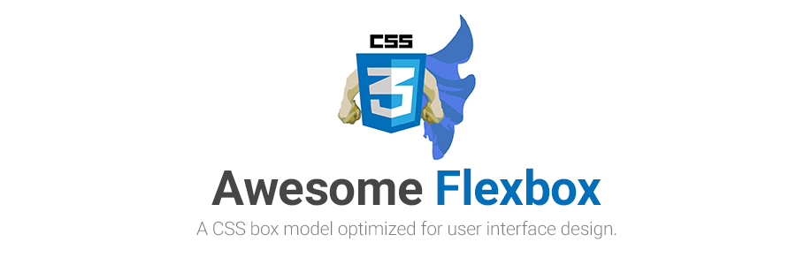

> A curated list of CSS Flexible Box Layout Module or only Flexbox.
Inspired by [awesome-webcomponents](https://github.com/obetomuniz/awesome-webcomponents) and [awesome-svg](https://github.com/willianjusten/awesome-svg).

## Table of Contents
* [W3C Specification](#w3c-specification)
* [Newsletter](#newsletter)
* [Books](#books)
* [Guides](#guides)
* [Cross Browser](#cross-browser)
 * [Articles](#articles)
 * [Support](#support)
 * [Preprocessors in Action](#preprocessors-in-action)
 * [Polyfills](#polyfills)
* [Other Interesting Articles](#other-interesting-articles)
* [Presentations](#presentations)
 * [Videos](#videos)
 * [Slides and Notes](#slides-and-notes)
* [Tools](#tools)
* [Libraries and Frameworks](#libraries-and-frameworks)
* [Featured Projects](#featured-projects)
* [Courses](#courses)
* [Who to Follow](#who-to-follow)
* [Contributing](#contributing)
* [Licence](#licence)

## W3C Specification
*The specification describes a CSS box model optimized for user interface design.*
* [CSS Flexible Box Layout Module Level 1](http://www.w3.org/TR/css3-flexbox/)

## Newsletter
* [CSS Layout News](http://csslayout.news/)
* [CSS Weekly](http://css-weekly.com/)
* [Responsive Design Weekly](http://responsivedesignweekly.com/)
* [Web Design Weekly](https://web-design-weekly.com/)

## Books
* [CSS3 Layout Modules 2nd Edition - Rachel Andrew](http://rachelandrew.co.uk/books/css3-layout-modules)

## Guides
*Guides for developers or designer start their studies this wonderful technology.*
* [A guide to flexbox](https://css-tricks.com/snippets/css/a-guide-to-flexbox/):metal:
* [A visual guide to CSS3 flexbox properties](https://scotch.io/tutorials/a-visual-guide-to-css3-flexbox-properties)
* [flexbox (pt-br)](http://desenvolvimentoparaweb.com/css/flexbox/)
* [Dive into flexbox](http://bocoup.com/weblog/dive-into-flexbox/)
* [How Flexbox works — explained with big, colorful, animated gifs](https://medium.freecodecamp.com/an-animated-guide-to-flexbox-d280cf6afc35)
* [How Flexbox works — explained with big, colorful, animated gifs (pt-br)](https://medium.com/@lucasjs/como-o-flexbox-funciona-explicado-com-gifs-grandes-e-coloridos-26c42a0bcdc)
* [Learn layout - flexbox (pt-br)](http://pt-br.learnlayout.com/flexbox.html)
* [Learn layout - flexbox](http://learnlayout.com/flexbox.html)
* [Reference of flexbox](http://tympanus.net/codrops/css_reference/flexbox/)
* [Responsive design of the future with flexbox](http://blog.teamtreehouse.com/responsive-design-of-the-future-with-flexbox)
* [The Flexbox Reading List: Techniques and Tools](https://www.smashingmagazine.com/author/cosima-mielke/)
* [Um guia visual para Flexbox (pt-br)](http://edsonjunior.com/um-guia-visual-para-flexbox/)
* [Usando caixas flexiveis CSS (pt-br)](https://developer.mozilla.org/pt-BR/docs/CSS/Usando_caixas_flexiveis_css)
* [Using CSS flexible boxes](https://developer.mozilla.org/en-US/docs/Web/Guide/CSS/Flexible_boxes)
* [What IS Flexbox?](https://medium.com/@spaceninja/what-is-flexbox-6aed968555ef)
* [Desarrollo de aplicaciones web Flexibles (es-es)](http://nucliweb.github.io/flexbox/)
* [Webflow Flexbox](https://flexbox.webflow.com/)

## Cross Browser
*Tips and tricks for your projects work anywhere :D*

#### Articles
* [6 Reasons to Start Using Flexbox](http://bitsofco.de/6-reasons-to-start-using-flexbox/?utm_campaign=CSS%2BLayout%2BNews&utm_medium=email&utm_source=CSS_Layout_News_31)
* [Advanced cross-browser flexbox](https://dev.opera.com/articles/advanced-cross-browser-flexbox/)
* [Are we ready to use flexbox?](http://www.sitepoint.com/are-we-ready-to-use-flexbox/)
* [CSS Flexbox Is Entirely Logical (Almost)](https://paulrobertlloyd.com/2016/03/logical_flexbox)
* [Designing A Product Page Layout with Flexbox](https://css-tricks.com/designing-a-product-page-layout-with-flexbox/)
* [Normalizando bugs no flexbox em diversos navegadores (pt-br)](http://imasters.com.br/front-end/css/normalizando-bugs-no-flexbox-em-diversos-navegadores/?trace=1519021197&source=single)
* [Normalizing cross-browser Flexbox bugs](http://philipwalton.com/articles/normalizing-cross-browser-flexbox-bugs/)
* [Using flexbox: mixing old and new for the best browser support](https://css-tricks.com/using-flexbox/)
* [Using Modernizr with Flexbox](http://zomigi.com/blog/using-modernizr-with-flexbox/?utm_campaign=CSS%2BLayout%2BNews&utm_medium=email&utm_source=CSS_Layout_News_8)

#### Support
* [Caniuse](http://caniuse.com/flexbox)

#### Preprocessors in action
* [Compass Flexbox](http://compass-style.org/reference/compass/css3/flexbox/)
* [Sass flex mixin](https://github.com/mastastealth/sass-flex-mixin)
* [Stylus flex mixin](https://github.com/differui/stylus-flex-mixin)

#### Polyfills
* [Flexibility](https://github.com/10up/flexibility):metal:
* [Flexie](https://github.com/doctyper/flexie)
* [Reflexie](https://github.com/doctyper/reflexie)

## Other Interesting Articles
*A list of issues related to flexbox.*
* [Almost complete guide to flexbox (without flexbox)](http://kyusuf.com/post/almost-complete-guide-to-flexbox-without-flexbox?utm_campaign=CSS%2BLayout%2BNews&utm_medium=email&utm_source=CSS_Layout_News_36):metal:
* [Designing CSS layouts with flexbox is as easy as pie](http://www.smashingmagazine.com/2015/03/02/harnessing-flexbox-for-todays-web-apps/)
* [Flexbox For Interfaces All The Way: Tracks Case Study](http://www.smashingmagazine.com/2015/11/flexbox-interfaces-tracks-case-study/?utm_source=html5weekly&utm_medium=email)
* [Flexbox’s Best-Kept Secret](https://medium.com/@samserif/flexbox-s-best-kept-secret-bd3d892826b6#.i0v3krqo0)
* [Grid, Flexbox, Box Alignment: Our New System for Layout](https://24ways.org/2015/grid-flexbox-box-alignment-our-new-system-for-layout/?utm_campaign=CSS%2BLayout%2BNews&utm_medium=email&utm_source=CSS_Layout_News_20)
* [Old flexbox and new flexbox](https://css-tricks.com/old-flexbox-and-new-flexbox/)
* [Using flexbox today](https://chriswrightdesign.com/experiments/using-flexbox-today/)
* [Laying Out A Flexible Future For Web Design With Flexbox](https://www.smashingmagazine.com/2015/08/flexible-future-for-web-design-with-flexbox/)
* [Flexbox Cheatsheet](http://jonibologna.com/flexbox-cheatsheet/)

## Presentations
*Tired of reading? See an interactive presentation and learn flexbox now.*

#### Videos
* [CSS Layout o ontem, o hoje e o depois (pt-br)](https://www.youtube.com/watch?v=MjK1MCjqmpU&list=PLnjYA3TxpDpgWE9cXwT5H7wEsG6ql-Q59&index=15)
* [CSS FlexBox Essentials](https://www.youtube.com/watch?v=G7EIAgfkhmg)
* [CSS FlexBox Practical Examples (Rebuilding Dribbble.com using FlexBox)](https://www.youtube.com/watch?v=H1lREysgdgc)
* [Exploring CSS Layout Techniques While Trying To Get a Subtitle to Wrap](https://css-tricks.com/video-screencasts/140-exploring-css-layout-techniques-while-trying-to-get-a-subtitle-to-wrap/)
* [Enhancing Responsiveness With Flexbox](https://www.youtube.com/watch?v=_98SE8WUvLk)
* [Flexbox - CSS Day](https://vimeo.com/131664957)
* [Guía Completa de Flexbox desde 0 (ESP)](https://www.youtube.com/watch?v=F-KCncXMPk0)
* [HTML5. Desenvolvimento avançado](https://www.youtube.com/watch?v=b9ZrOdTFkNk)
* [Introduction to Flexbox](https://mijingo.com/lessons/guide-to-flexbox/?utm_campaign=CSS%2BLayout%2BNews&utm_medium=email&utm_source=CSS_Layout_News_34)
* [Leveling up with flexbox](https://vimeo.com/96406277)
* [What the flexbox?](http://flexbox.io) - A simple 20 video course that will help you master
* [Flexbox Fundamentals](https://egghead.io/lessons/misc-flexbox-fundamentals)

### [Sketching with CSS](http://www.sketchingwithcss.com) Flexbox Guide by [@sfioritto](https://github.com/sfioritto)

#### Read Materials
* [Access 20+ Page Guide on Flexbox](http://www.sketchingwithcss.com/flexbox-tutorial/)

#### Video Materials
* [Flex-Container Pt. 1: Position Items within a flexbox container](http://www.sketchingwithcss.com/flex-container)
* [Flex-Container Pt. 2: Rows and Columns](http://www.sketchingwithcss.com/flex-container-2/)
* [Grow and Shrink Flex Items](http://www.sketchingwithcss.com/grow-shrink/)
* [Implementing the Sticky Footer and Holy Grail layout](http://www.sketchingwithcss.com/flex-layouts/)

#### Slides and Notes
* [Building responsive layouts presentation](http://zomigi.com/blog/responsive-layouts-css-dev-conf/)
* [CSS Flexbox: Estruturando layouts sem gambiarras (pr-br)](https://speakerdeck.com/afonsopacifer/flexbox)
* [CSS3 layout](http://zomigi.com/blog/css3-layout/)
* [Flexbox](http://zomigi.com/blog/flexbox-presentation/)
* [Flexbox and Grid Layout](http://pt.slideshare.net/diegoeis/flexbox-to-the-people)
* [Future css layout fowd](http://zomigi.com/blog/future-css-layout-fowd/)
* [Leveling up with flexbox](http://zomigi.com/blog/leveling-up-with-flexbox/)
* [RWD flexbox](http://zomigi.com/blog/rwd-flexbox/)
* [CSS Layout: from Table to Flexbox](https://speakerdeck.com/diogomoretti/css-layout-from-table-to-flexbox)

## Tools
*Have a little help to create their projects :D*
* [Build with Flexbox](http://flexbox.buildwithreact.com/)
* [CSS flexbox please](http://demo.agektmr.com/flexbox/)
* [CSS Flexbox snippets for Atom](https://github.com/brenopolanski/css-flexbox-atom-snippets)
* [CSS Flexbox snippets for Sublime Text 2/3](https://github.com/brenopolanski/css-flexbox-sublime-snippets)
* [Fibonacci](https://github.com/maxsteenbergen/Fibonacci)
* [Flexbox in 5 minutes](https://cvan.io/flexboxin5/)
* [Flexbox playground](https://web.archive.org/web/20151207135410/http://flexiejs.com/playground/)
* [Flexbox property manipulator](http://codepen.io/enxaneta/full/adLPwv/)
* [Flexplorer](http://bennettfeely.com/flexplorer/)
* [Flexyboxes](http://the-echoplex.net/flexyboxes/)
* [Test CSS Flexbox Rules Live](http://flexbox.help/)
* [Try Flexbox](https://zyxneo.github.io/flexbox/try-flexbox)

## Libraries and Frameworks
*A list of incredible libraries based on flexbox.*
* [Bem grid](https://github.com/bem-incubator/bem-grid)
* [Flexboxgrid](https://github.com/kristoferjoseph/flexboxgrid):metal:
* [Flex Grid Framework](https://afonsopacifer.github.io/flex-grid-framework/):metal:
* [Flexbox Grid for Stylus](http://stylusgrid.com)
* [Fuux](https://github.com/henriquecustodia/fuux) - Fuux is a Flexbox library that uses the same flexbox interface like classes.
* [Ginger Grid](https://github.com/erwstout/ginger/) - A Flexbox grid framework named after a cute dog.
* [Bulma](http://bulma.io/) - A modern CSS framework based on Flexbox
* [Milligram](http://milligram.github.io/) - A minimalist CSS framework
* [RolleiFLEX](http://kaisermann.github.io/rolleiflex/) - Just a responsive flexbox grid
* [Waffle Grid](https://lucasgruwez.github.io/waffle-grid) - An easy to use flexbox grid system

## Featured Projects
*Awesome projects about flexbox.*
* [Cool examples of flexbox layout](http://codepen.io/collection/KegmA/) - A codepen a collection.
* [flex-box](https://github.com/potch/flex-box) - A Custom Element to make the basics of flexbox easier to use.
* [Flexbugs](https://github.com/philipwalton/flexbugs) - A community-curated list of flexbox issues and cross-browser workarounds for them.
* [Flexbox Froggy](http://flexboxfroggy.com/) - A game for learning CSS flexbox.
* [Flexbox Patterns](http://www.flexboxpatterns.com/) - Examples and source code that will teach you how to build UI components with CSS flexbox! What’s flexbox?
* [Flexbox Defense](http://www.flexboxdefense.com/) - Tower Defense with a twist: all towers must be positioned with CSS Flexbox.
* [Flexbox tester](http://madebymike.com.au/demos/flexbox-tester/) - Understand how to calculate the width of flex items.
* [Flexbox layout](https://github.com/google/flexbox-layout) - FlexboxLayout is a library project which brings the similar capabilities of CSS Flexible Box Layout Module to Android.
* [FlexLayout for iOS](https://github.com/lucdion/FlexLayout) - FlexLayout brings flexbox to iOS using Swift. Concise, intuitive & chainable syntax.
* [grid-styled](https://github.com/jxnblk/grid-styled) - Flexbox based responsive ReactJS grid system built with styled-components
* [iron-flex-layout](https://www.webcomponents.org/element/PolymerElements/iron-flex-layout) - Style mixins for cross-platform flex-box layouts
* [Post Apocalypse Flexbox](https://github.com/afonsopacifer/post-apocalypse-flexbox)
* [React-flexbox](https://github.com/tcoopman/react-flexbox) - Implementation of css flexbox in react with inline styles.
* [Reflexbox](https://github.com/jxnblk/reflexbox) - Responsive React flexbox grid system higher order component.
* [Solved by flexbox](https://github.com/philipwalton/solved-by-flexbox) - A showcase of problems once hard or impossible to solve with CSS alone, now made trivially easy with Flexbox.:metal:
* [Visualizing Flexbox](http://codepen.io/paultrone/pen/xwxNmQ?utm_campaign=CSS%2BLayout%2BNews&utm_medium=email&utm_source=CSS_Layout_News_6) - A neat little CodePen Demo to play around with Flex properties.
* [ZEEF CSS Flexbox](https://css-flexbox.zeef.com/afonso.pacifer) - The awesome flexbox on zeef.:metal:
* [Flexbox Zombies](http://flexboxzombies.com/p/flexbox-zombies) - A game for learning CSS flexbox.

## Courses
* [CSS Flexbox Layout](https://teamtreehouse.com/library/css-flexbox-layout?utm_source=Responsive+Design+Weekly&utm_campaign=e4dbc18ebc-Responsive_Design_Weekly_184&utm_medium=email&utm_term=0_df65b6d7c8-e4dbc18ebc-59080665&goal=0_df65b6d7c8-e4dbc18ebc-59080665) - treehouse

## Who to Follow
*People who talk about it.*
* Afonso Pacifer [@afonsopacifer](https://twitter.com/afonsopacifer)
* Brad Frost [@brad_frost](https://twitter.com/brad_frost)
* Chris Coyier [@chriscoyier](https://twitter.com/chriscoyier)
* Lea Verou [@LeaVerou](https://twitter.com/leaverou)
* Mickley Gillenwater [@zomigi](https://twitter.com/zomigi)
* Nicolas [@necolas](https://twitter.com/necolas)
* Philip Walton [@philwalton](https://twitter.com/philwalton)
* Rachel Andrew [@rachelandrew](https://twitter.com/rachelandrew)
* Richard Herrera [@doctyper](https://twitter.com/doctyper)
* Sara Soueidan [@SaraSoueidan](https://twitter.com/SaraSoueidan)
* Sean Fioritto [@sfioritto](https://twitter.com/sfioritto)

## Contributing
Want to contribute? [Follow these recommendations](https://github.com/afonsopacifer/awesome-flexbox/blob/master/contributing.md).

## License
[MIT License](https://github.com/afonsopacifer/awesome-flexbox/blob/master/license.md) © [Afonso Pacifer](https://afonsopacifer.github.io/)
